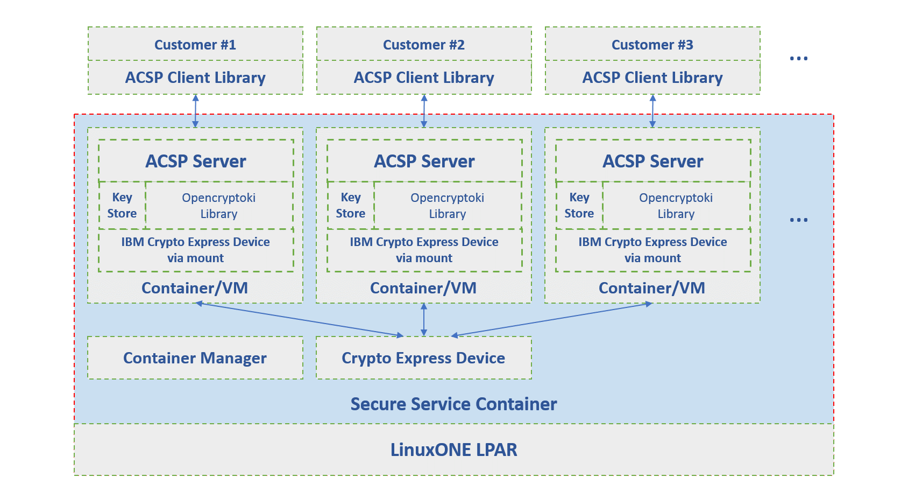

---

copyright:
  years: 2018
lastupdated: "2018-03-16"

---

{:new_window: target="_blank"}
{:shortdesc: .shortdesc}
{:screen: .screen}
{:codeblock: .codeblock}
{:pre: .pre}

# About {{site.data.keyword.cloud_notm}} {{site.data.keyword.hscrypto}}

> _**Disclaimer: {{site.data.keyword.cloud}} {{site.data.keyword.hscrypto}} is still in experimental phase and it might change at anytime.**_

Data and information security is crucial and essential for IT environments. As more and more data moves to the cloud, keeping data safe and secure becomes a non trivial challenge.  {{site.data.keyword.cloud_notm}} {{site.data.keyword.hscrypto}} offers cryptography with industry's highest security level to protect your data in a hyper secure manner.
{: shortdesc}

{{site.data.keyword.hscrypto}} brings the security and integrity of System z to the cloud. The same state-of-the-art cryptographic technology that banks and financial services rely on is now offered to cloud users via {{site.data.keyword.cloud_notm}}. With {{site.data.keyword.hscrypto}}, you can secure your data at rest, in use, and in transit. {{site.data.keyword.hscrypto}} also binds the {{site.data.keyword.keymanagementservicefull_notm}} service and protect your keys in a hyper secure environment on System z.

Behind the cloud, {{site.data.keyword.hscrypto}} offers network addressable hardware security modules (HSMs) to provide safe and secure cryptography via PKCS#11 application programming interfaces (APIs). You can access {{site.data.keyword.hscrypto}} with several popular programming languages such as Java, JavaScript, Swift, and so on.

*Figure 1. Architecture*

## Provisioning a {{site.data.keyword.hscrypto}} instance
{: #provision}

You can create an instance of {{site.data.keyword.hscrypto}} from the {{site.data.keyword.cloud_notm}} console.

Complete the following steps to provision {{site.data.keyword.hscrypto}}:
1. Log in to your [IBM Cloud account ](https://console.bluemix.net/){:new_window}.
2. Visit [{{site.data.keyword.cloud_notm}} Experimental Services ](https://console.bluemix.net/catalog/labs/){:new_window} to see the list of services in experimental phase.
3. From the **All Categories** navigation pane on the left, click the **Security** category under **Platform**.
4. From the list of services, click the **{{site.data.keyword.hscrypto}}** tile.
5. Select the **{{site.data.keyword.hscrypto}} Lite Plan**, and click **Create** to provision an instance of {{site.data.keyword.IBM_notm}} CloudCrypto in the account, region, and resource group where you log in.

## Key features

{{site.data.keyword.hscrypto}} provides access to the highest level attainable of security for cryptographic hardware, that is, **FIPS 140-2 Level 4**. Industries, such as financial secure services, require this level of security to protect their data. At this security level, the physical security mechanisms provide a complete envelope of protection around the cryptographic module with the intent of detecting and responding to all unauthorized attempts at physical access.

{{site.data.keyword.hscrypto}} brings the unique capabilities of data protection from IBM Z to {{site.data.keyword.cloud_notm}}. {{site.data.keyword.hscrypto}} secures your data in **Secure Service Container (SSC)** that provides the enterprise-level of security and impregnability that enterprise customers have come to expect from IBM Z technology. Hardware virtualisation is used to protect your data in an isolated environment. SSC allows no external access, including privileged users such as cloud administrators, to your data. Data is encrypted at rest, in process, and in flight. The available support for **hardware security modules (zHSM)** allows for digital keys to be protected in accordance with industry regulations. The zHSM provides safe and secure **PKCS#11 APIs**, which makes {{site.data.keyword.hscrypto}} accessible by several popular programming languages like Java, JavaScript, Swift etc.

{{site.data.keyword.hscrypto}} also leverages the **IBM Advanced Crypto Service Provider (ACSP)** solution that enables remote access to the IBM’s cryptographic coprocessors. ACSP allows for utilization of strong hardware-based cryptography as a service in distributed environments where data security cannot be guaranteed. {{site.data.keyword.hscrypto}} utilizes ACSP as a “network hardware security module (NetHSM)” that provides access to zHSM via PKCS#11 standard APIs.

With {{site.data.keyword.hscrypto}}, your **SSL keys are offloaded** to a {{site.data.keyword.hscrypto}} to ensure security and protection of those sensitive keys.  Besides, the certificate lifecycle management gets common approach to manage certs and offers the visibility to cert expiration.

{{site.data.keyword.hscrypto}} is the cryptography that **{{site.data.keyword.blockchainfull_notm}} Platform** is built with. This cryptography mechanism ensures that the blockchain network is running in a highly-secure and isolated environment, and greatly accelerates hashing, sign/verify operations, and node-to-node communications in the network. The success of {{site.data.keyword.blockchainfull_notm}} Platform proves the capbility and value of {{site.data.keyword.hscrypto}}.
