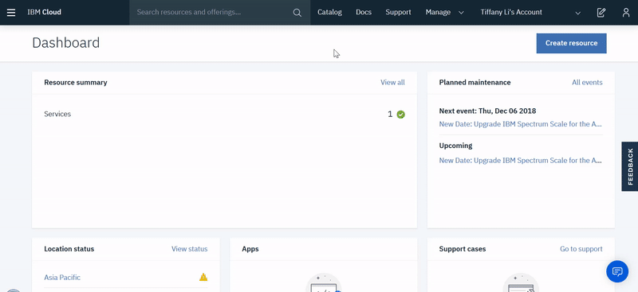

---

copyright:
  years: 2018, 2019
lastupdated: "2019-01-21"

---

{:shortdesc: .shortdesc}
{:codeblock: .codeblock}
{:screen: .screen}
{:new_window: target="_blank"}
{:pre: .pre}
{:tip: .tip}
{:gif: data-image-type='gif'}

# Provisioning the service
{: #provision}

You can create an instance of {{site.data.keyword.cloud_notm}} {{site.data.keyword.hscrypto}} by using the {{site.data.keyword.cloud_notm}} console or the {{site.data.keyword.cloud_notm}} CLI.
{: shortdesc}

## Provisioning from the {{site.data.keyword.cloud_notm}} console
{: #gui}

To provision an instance of {{site.data.keyword.hscrypto}} from the {{site.data.keyword.cloud_notm}} console, complete the following steps:

1. [Log in to your {{site.data.keyword.cloud_notm}} account ](https://console.bluemix.net/){: new_window}.
2. Click **Catalog** to view the list of services that are available on {{site.data.keyword.cloud_notm}}.
3. From the All Categories navigation pane, click the **Security and Identity** category.
4. From the list of services, click the **{{site.data.keyword.hscrypto}}** tile.
5. Select a service plan, and click **Create** to provision an instance of {{site.data.keyword.hscrypto}} in the account, region, and resource group where you are logged in.


{: gif}

*Figure 1. Provisioning the service*

<!-- ## Provisioning from the {{site.data.keyword.cloud_notm}} CLI
{: #cli}

To provision an instance of {{site.data.keyword.hscrypto}} using the {{site.data.keyword.cloud_notm}} CLI, complete the following steps:

1. Download and install the [{{site.data.keyword.cloud_notm}} CLI](/docs/cli/index.html#overview){: new_window} with the  following command:

    ```sh
    curl -sl https://ibm.biz/idt-installer | bash
    ```
    {: pre}

    **Notes:** For more information about the {{site.data.keyword.cloud_notm}} CLI, see [Getting started with the {{site.data.keyword.cloud_notm}} CLI](/docs/cli/index.html#overview){: new_window}.

2. Log in to {{site.data.keyword.cloud_notm}} through the {{site.data.keyword.cloud_notm}} CLI with the following command:

    ```sh
    ibmcloud login
    ```
    {: pre}

    **Notes:** If the login fails, run the `ibmcloud login --sso` command to try again. The `--sso` parameter is required when you log in with a federated ID. If this option is used, go to the link listed in the CLI output to generate a one-time passcode. -->

<!-- ### Creating a service instance within your account
{: #provision-acct-lvl}

To simplify access to your encryption keys with [{{site.data.keyword.iamlong}} roles](/docs/iam/users_roles.html#iamusermanrol), you can create one or more instances of the {{site.data.keyword.hscrypto}} service within an account, without needing to specify an org and space.

1. Log in to {{site.data.keyword.cloud_notm}} through the [{{site.data.keyword.cloud_notm}} CLI](/docs/cli/index.html#overview){: new_window}.

    ```sh
    ibmcloud login
    ```
    {: pre}
    **Notes:** If the login fails, run the `ibmcloud login --sso` command to try again. The `--sso` parameter is required when you log in with a federated ID. If this option is used, go to the link listed in the CLI output to generate a one-time passcode.

2. Select the account, region, and resource group where you would like to create a {{site.data.keyword.hscrypto}} service instance.

    You can use the following command to set your target region and resource group.

    ```sh
    ibmcloud target -r <region_name> -g <resource_group_name>
    ```
    {: pre}

3. Provision an instance of {{site.data.keyword.hscrypto}} within that account and resource group.

    ```sh
    ibmcloud resource service-instance-create <instance_name> kms tiered-pricing
    ```
    {: pre}

    Replace `<instance_name>` with a unique alias for your service instance.

4. Optional: Verify that the service instance was created successfully.

    ```sh
    ibmcloud resource service-instances
    ```
    {: pre}

### Creating a service instance within an org and space
{: #provision-space-lvl}

To manage access to your encryption keys with [Cloud Foundry roles](/docs/iam/cfaccess.html), you can create an instance of the {{site.data.keyword.hscrypto}} service within a specified organization and space.  

1. Log in to {{site.data.keyword.cloud_notm}} through the [{{site.data.keyword.cloud_notm}} CLI](/docs/cli/index.html#overview){: new_window}.

    ```sh
    ibmcloud login
    ```
    {: pre}
    **Note:** If the login fails, run the `ibmcloud login --sso` command to try again. The `--sso` parameter is required when you log in with a federated ID. If this option is used, go to the link listed in the CLI output to generate a one-time passcode.

2. Select the account, region, organization, and space where you would like to create a {{site.data.keyword.hscrypto}} service instance.

    You can use the following command to set your target region, org, and space.

    ```sh
    ibmcloud target -r <region> -o <organization_name> -s <space_name>
    ```
    {: pre}

3. Provision an instance of {{site.data.keyword.hscrypto}} within that account, region, organization, and space.

    ```sh
    ibmcloud service create kms tiered-pricing <instance_name>
    ```
    {: pre}

    Replace `<instance_name>` with a unique alias for your service instance.

4. Optional: Verify that the service instance was created successfully.

    ```sh
    ibmcloud service list
    ```
    {: pre}


### What's next

- To see an example of how keys stored in {{site.data.keyword.hscrypto}} can work to encrypt and decrypt data, [check out the sample app in GitHub ](https://github.com/IBM-Bluemix/key-protect-helloworld-python){: new_window}.
- To find out more about programmatically managing your keys, [check out the {{site.data.keyword.hscrypto}} API reference doc ](https://console.bluemix.net/apidocs/hp-crypto){: new_window}.-->
